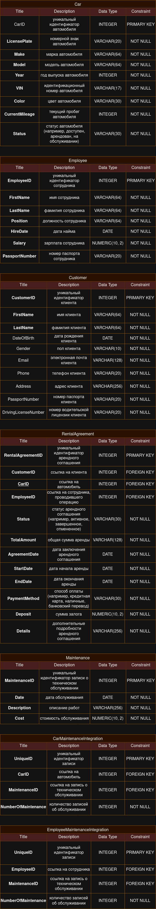

# База данных аренды авто

## Концептуальная модель

## Логическая модель

## Физическая модель

### Идея

База данных аренды автомобилей предназначена для управления информацией о клиентах, автомобилях, сотрудниках, техническом обслуживании автомобилей и арендных соглашениях. База данных находится в третьей нормальной форме (3НФ), что обеспечивает атомарность атрибутов, минимизацию дублирования данных и отсутствие транзитивных функциональных зависимостей от ключей.

### Описание сущностей

